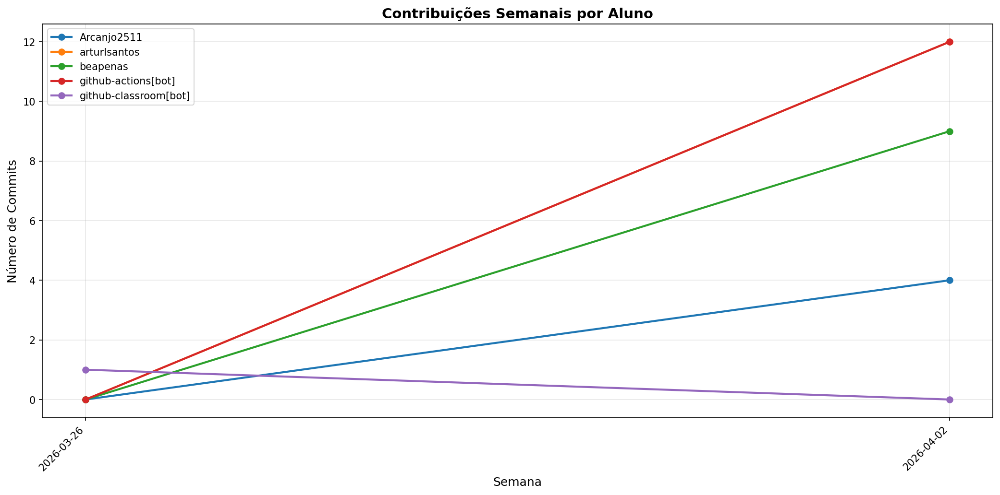

# 📊 Relatório de Contribuições do Projeto

**Última atualização:** 09/04/2026 03:22

---

## 📈 Resumo Geral de Contribuições

| Aluno                 |   Commits |   Linhas+ |   Linhas- |   Arquivos |   Docs Commits |   Docs Arquivos |
|-----------------------|-----------|-----------|-----------|------------|----------------|-----------------|
| Arcanjo2511           |         4 |         7 |         7 |          1 |              4 |               1 |
| arturlsantos          |        12 |       112 |        72 |          4 |             12 |               1 |
| beapenas              |         9 |        21 |        21 |          3 |              9 |               2 |
| github-actions[bot]   |        12 |        91 |        42 |          3 |             12 |               1 |
| github-classroom[bot] |         1 |       774 |         0 |         19 |              1 |               3 |

## 📅 Contribuições Semanais (Todo o Semestre)

**2026-04-02**: Arcanjo2511: 4, arturlsantos: 12, beapenas: 9, github-actions[bot]: 12

**2026-03-26**: github-classroom[bot]: 1

## 📊 Visualização Gráfica

## ℹ️ Observações

- **Commits**: Número total de commits realizados

- **Linhas+**: Linhas de código adicionadas

- **Linhas-**: Linhas de código removidas

- **Arquivos**: Número de arquivos únicos modificados

- **Docs Commits**: Commits em arquivos de documentação

- **Docs Arquivos**: Arquivos de documentação modificados

---

*Relatório gerado automaticamente via GitHub Actions*
